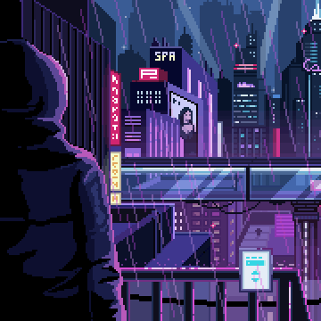
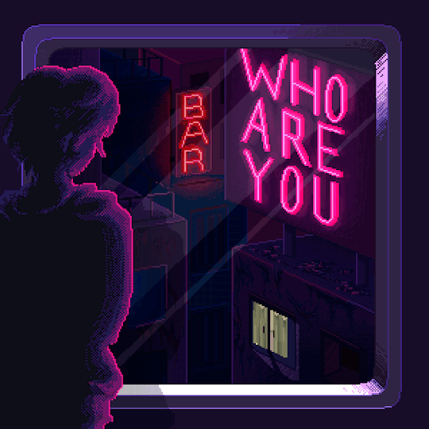

<h2 align="center">📋&ensp; <i>Ｓｏｂｒｅ</i> &ensp;📋</h2>

<!-- <table align="center">
  <tr>
    <td>
      <b>
        <a href="README.md">🇧🇷 Português</a>
      </b>
    </td>
    <td>
      <a href="README-EN.md">🇺🇸 English</a>
    </td>
  </tr>
</table> -->
<ul align="left">
    <li>🤩️ Amante de Tecnologia, Jogos, filmes é series 🤩️</li> 
    <li>🚀 Sou um profissional altamente proativo, com uma paixão ardente por trabalhar em equipe e contribuir para um ambiente colaborativo. Minha dedicação ao desenvolvimento de sistemas responsivos é evidente na atenção meticulosa que dou à experiência do usuário e à interface do usuário, sempre buscando a excelência em IU/UX. 🚀</li> 
    <li>💻 Estudo na Faculdade <a href="https://www2.ufjf.br/ufjf/" target="_blank">UFJF</a> e nas escolas de formação de devs <a href="https://www.rocketseat.com.br/" target="_blank">Rocketseat</a> é <a href="https://www.dio.me" target="_blank">DIO</a>. Com um conhecimento robusto em ferramentas de design como Figma e habilidades técnicas em Vue.js, Ionic, Electron e Python, estou sempre em busca de oportunidades para criar soluções inovadoras que não apenas atendam, mas superem as expectativas dos usuários. 💻</li> 
    <li>🔮 Acredito firmemente que meu entusiasmo e habilidade técnica serão ativos valiosos para qualquer equipe e projeto. 🔮</li> 
</ul>
 

<h2 align="center">🛠️&ensp; <i>Ｔｅｃｎｏｌｏｇｉａｓ</i> &ensp;🛠️</h2>
 
<table align="center" height="300px">
  <tr>
    <td align="center">
       
      
        <b>
          <pre>VSCode</pre>
        </b>
      
    </td>
    <td align="center">
       
      
        <b>
          <pre>HTML</pre>
        </b>
      
    </td>
    <td align="center">
       
      
        <b>
          <pre>&ensp;CSS&ensp;</pre>
        </b>
      
    </td>
    <td align="center">
       
      
        <b>
          <pre>JavaScript</pre>
        </b>
      
    </td>
    <td align="center" width="100px;">
       
      
        <b>
          <pre>&emsp;Git&emsp;</pre>
        </b>
      
    </td>
    <td align="center" width="100px;">
       
      
        <b>
          <pre>&emsp;GitHub&emsp;</pre>
        </b>
      
    </td>
    <td align="center">
       
      
        <b>
          <pre>Python</pre>
        </b>
      
    </td>
  </tr>
  <tr>
    <td align="center">
       
      
        <b>
          <pre>Figma</pre>
        </b>
      
    </td>
    <td align="center">
       
      
        <b>
          <pre>Vue</pre>
        </b>
      
    </td>
     <td align="center">
       
      
        <b>
          <pre>Yarn/npm</pre>
        </b>
      
    </td>
    <td align="center">
       
      
        <b>
          <pre>ViteJS</pre>
        </b>
      
    </td>
    <td align="center">
       
      
        <b>
          <pre>TypeScript</pre>
        </b>
      
    </td>
    <td align="center">
       
      
        <b>
          <pre>NodeJS</pre>
        </b>
      
    </td>
    <td align="center">
       
      
        <b>
          <pre>Terminal</pre>
        </b>
      
    </td>
  </tr>
</table> 
  

<h2 align="center">💬&ensp; <i>Ｃｏｎｔａｔｏｓ</i> &ensp;💬</h2>

  

  
   
   
  
  
  

   

<h2 align="center">👨🏻‍💻&ensp; <i>Ｐｒｏｊｅｔｏｓ</i> &ensp;👨🏻‍💻</h2>

<table height="495px" width="365px">
  <tr>
    <td>
    
    </td>
  </tr>
  <tr>
    <td>
    
    </td>
  </tr>
  <tr>
    <td>
    
    </td>
  </tr>
  <tr>
    <td>
    
    </td>
  </tr>
  <tr>
    <td>
    
    </td>
  </tr>
  <tr>
    <td>
     
    </td>
  </tr>
</table>
 

<h2 align="center">

📈&ensp; <i>Ａｔｉｖｉｄａｄｅｓ</i> &ensp;📈

 

  
   
  

